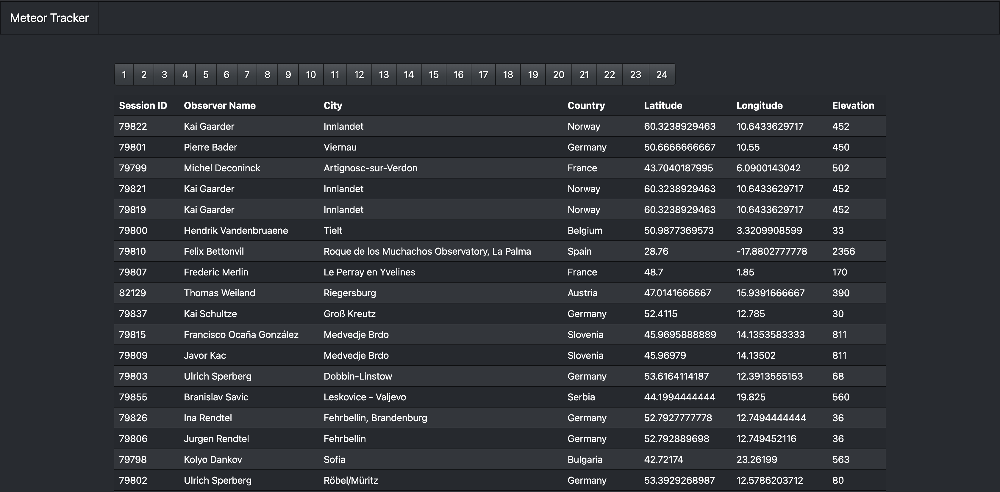

# Alula Meteor Tracker

This is a dead-simple demo Node.js app for code excersizes.



## Dependencies

- Node.js 14 or greater
- Postgres 12

## Development

1. Copy the `.env.sample` => `.env`
2. Fill out the appropriate values
3. Must have DB running to develop locally.

4. Install deps with `yarn install`

5. ```
   $ yarn start:api
   ```

   In another terminal:

   ```
   $ yarn start:app
   ```

6. Navigate to `localhost:9001` or whatever you set the `PORT` to.

### Docker Compose

Make sure to fill in the appropriate values for the `environment` keys in `docker-compose.yaml`

Run `docker compose up --build`

Navigate to the port exposed for the `app` service.
